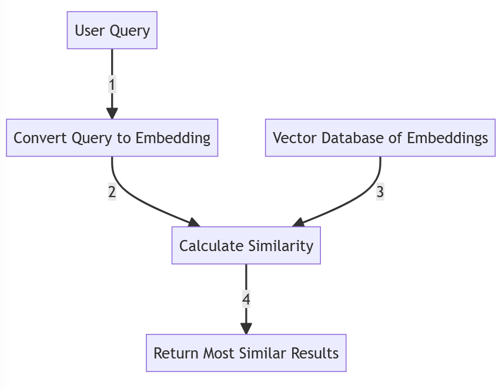

## Introduction

A command-saving and retrieval CLI tool can greatly enhance developer productivity by allowing natural language lookup of saved commands. The core idea is to store each command with a descriptive text, convert those descriptions into vector embeddings, and later retrieve the most relevant command by finding embeddings similar to the user’s query. This approach enables semantic search – e.g. a query like “start RabbitMQ service” can match a saved description “how to start rabbitmq” even if phrasing differs. A robust architecture is needed to accommodate different embedding models, ensure reliable matching (beyond basic cosine similarity), and prioritize local-first operation (with offline capability), while remaining extensible to cloud services if needed.

